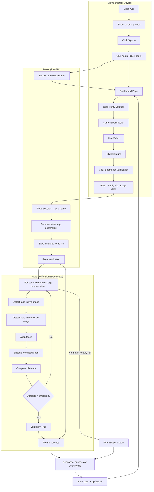

# Face Authentication App — Technical Documentation

This document explains how the app works end-to-end, what technology it uses, how face verification actually runs, and when it can fail. It is written so you can explain it to both technical and non-technical audiences.

---

## 1. Executive Summary (Non-Technical)

**What does this app do?**  
A user signs in by choosing their name (Alice, Bob, or Charlie). Then they can “verify themselves” by taking a selfie with the camera. The system checks: *“Is this the same person as in the photos we have on file for that user?”* If yes, they see a welcome message and can submit a form. If no, they see “User invalid.”

**In one sentence:**  
The app uses **face recognition** to confirm that the person in front of the camera is the same person whose photos are stored for the account they logged into.

**What the system does *not* do:**  
- It does **not** store or process your face to identify you from scratch in a large database.  
- It only **compares** one photo (the one you just took) against a small set of reference photos for the user you claimed to be.

---

## 2. Technology Stack (What We Use)

| Layer | Technology | Role |
|-------|------------|------|
| **Backend** | FastAPI (Python) | Web server: login, dashboard, session, and the `/verify` API. |
| **Templates** | Jinja2 | Renders HTML pages (login, dashboard) with dynamic data. |
| **Frontend** | HTML, CSS, JavaScript | Login form, dashboard form, “Verify yourself” button, camera UI. |
| **Camera / Capture** | Browser APIs | `getUserMedia` for camera; Canvas for capturing a single frame as an image. |
| **Face verification** | DeepFace (Python library) | Detects faces in images and compares two faces (same person or not). |
| **Session** | Starlette SessionMiddleware | Keeps the “logged-in user” (e.g. Alice) in a cookie-based session. |
| **Storage** | File system | Reference photos per user live in folders: `users/alice/`, `users/bob/`, `users/charlie/`. |

**Dependencies (brief):**  
- **DeepFace** uses **TensorFlow** and optional **RetinaFace** for better detection at angles.  
- **OpenCV** (via DeepFace) is used for image handling and one of the face detectors.

---

## 3. How Face Verification Works (Technical)

### 3.1 What the System “Sees” and Uses

- **Input 1 — “Live” image:**  
  The photo taken at verification time (from the browser camera, sent as image bytes to the server).

- **Input 2 — Reference images:**  
  All images inside the folder for the logged-in user (e.g. `users/alice/*.jpg`). Each image can contain one or more faces.

- **What is compared:**  
  The system does **not** compare raw pixels. It:
  1. **Detects** the face region(s) in each image (your photo + each reference photo).
  2. **Aligns** the face (normalizes rotation/tilt) when alignment is enabled.
  3. **Encodes** each detected face into a fixed-size vector (embedding) using a neural network (e.g. ArcFace or Facenet).
  4. **Compares** the embedding of the live face with the embedding of each reference face using a **distance** (e.g. cosine distance). If the distance is below a threshold, the two faces are considered “same person.”

So the only “details” used for the decision are these **numeric vectors (embeddings)** and their distances. No raw face image is stored long-term by the verification logic; the reference photos are only used to compute embeddings and compare.

### 3.2 Steps Inside the Verification Pipeline (with precomputed embeddings)

1. **Receive image**  
   The server gets the captured image (either as base64 in JSON or as a file upload).

2. **Save to temp file**  
   The image is written to a temporary file so the DeepFace library can read it.

3. **Reference embeddings (precomputed)**  
   - On **first use** for a user (or when their reference photos change), we compute embeddings for **all** reference images in that user’s folder and store them **in memory** and optionally in a **disk cache** (`.face_embeddings.pkl` in the user folder).  
   - On later requests we **reuse** this cache, so we do **not** recompute reference embeddings every time.

4. **Live image embedding (once per request)**  
   We run the detector + model **once** on the captured image to get a single face embedding.

5. **Compare**  
   We compare the live embedding to **each** cached reference embedding using **cosine distance**. If any distance is below the model’s threshold, the user is verified.

So after the first verification (or after reference photos change), **only one embedding is computed per verification request**; all reference embeddings are read from cache. This reduces compute time and latency.

**Cache invalidation:** The cache is keyed by the user folder and the list of file modification times. If you add, remove, or replace a reference photo, the next verification for that user will recompute embeddings and update the cache (in memory and, if enabled, on disk). The cache file is `.face_embeddings.pkl` inside each user folder; you can delete it to force a full recompute.

### 3.3 What Can Go Wrong (When It “Breaks”)

| Scenario | What happens | Why |
|----------|--------------|-----|
| **No face in the captured image** | “No face detected” (or similar) | Detector could not find a face (e.g. too dark, too far, hand in front, extreme angle). |
| **Face at extreme angle** | May not detect face, or may fail to match | Detectors and models work best with frontal or moderate angles; extreme profile or chin up/down can fail. |
| **Wrong person** | “User invalid” | Embedding distance is above threshold (correct behavior). |
| **No reference photos** | “No reference face images found” | User folder is empty or has no valid image files. |
| **Reference photo has no detectable face** | That reference is skipped; others still used | One bad reference does not break the whole flow. |
| **Poor lighting / blur** | May not detect or may fail to match | Quality of both live and reference images affects detection and embedding. |
| **Different appearance** | May fail even if same person | Heavy makeup, glasses on/off, beard, etc. can change embeddings enough to exceed threshold. |
| **Model/backend not available** | Fallback (e.g. Facenet, OpenCV) or error | e.g. ArcFace or RetinaFace missing; code falls back where possible. |

So the system “breaks” (fails to verify) when:  
- No face is detected in the live image, or  
- The live face does not match *any* reference face (wrong person, or same person but appearance/angle/quality outside what the model accepts).

---

## 4. End-to-End Flow

### 4.1 High-Level User Journey

```
User opens app → Chooses user (e.g. Alice) → Clicks "Sign in"
    → Server creates session "logged in as Alice"
    → User sees dashboard (form + "Verify yourself" button)
    → User clicks "Verify yourself" → Browser asks for camera permission
    → User sees live video → Clicks "Capture" → Clicks "Submit for verification"
    → Browser sends captured image to server
    → Server runs face verification (live image vs. users/alice/*)
    → Server returns success or "User invalid"
    → If success: "Welcome, Alice!" and Submit button enabled
    → If fail: "User invalid" and optional message (e.g. no face detected)
```

### 4.2 Flow Diagram (Mermaid)

You can paste this into any Mermaid-supported viewer (e.g. GitHub, GitLab, or [mermaid.live](https://mermaid.live)) to see the diagram.



### 4.3 ASCII Flow (Plain Text / Terminal)

```
+--------+     +--------+     +--------+     +------------------+
| User   |     | Browser|     | Server |     | Face verification|
+--------+     +--------+     +--------+     +------------------+
    |               |               |                 |
    | Open app      |               |                 |
    |-------------->| GET /         |                 |
    |               |------------->| Redirect /login  |
    |               |<-------------|                 |
    | Select user   |               |                 |
    | Sign in       | POST /login   |                 |
    |-------------->|------------->| Session = Alice  |
    |               |<-------------| Redirect /dashboard
    | Dashboard     |               |                 |
    |<--------------|               |                 |
    | Verify self   |               |                 |
    |-------------->| Camera on     |                 |
    | Capture       |               |                 |
    | Submit        | POST /verify  |                 |
    |-------------->| { image }     |                 |
    |               |------------->| Session -> Alice |
    |               |               |---------------->| Compare to
    |               |               |                 | users/alice/*
    |               |               |<----------------| verified T/F
    |               |<-------------| JSON result     |
    | Toast + UI    |               |                 |
    |<--------------|               |                 |
```

### 4.4 Simplified Linear Flow (Text)

```
1. User → Opens app (GET /)
2. Server → Redirects to /login (no session) or /dashboard (has session)
3. User → Selects "Alice", clicks Sign in (POST /login)
4. Server → Sets session (username=alice), redirects to /dashboard
5. User → Sees dashboard; clicks "Verify yourself"
6. Browser → Asks camera permission; shows video stream
7. User → Capture → Submit for verification
8. Browser → POST /verify with JSON body { image: "<base64 of captured frame>" }
9. Server → Reads session → username = alice → folder = users/alice/
10. Server → Writes image to temp file
11. Server → Calls verify_image_file(temp_path, users/alice/)
12. Face_utils → For each image in users/alice/:
    - DeepFace.verify(live_image, reference_image, model=ArcFace, detector=retinaface/mtcnn/opencv)
    - If any returns verified=True → return (True, message)
13. Server → If True: JSON { success: true, message: "Welcome, Alice!", verified: true }
            Else: JSON { success: false, message: "User invalid.", verified: false }
14. Browser → Shows toast, enables/disables Submit button
15. User → Can submit form if verified
```

### 4.5 One-Slide Summary (For Presentations)

**Flow in one sentence:**  
User signs in → clicks “Verify yourself” → browser captures a photo → server compares that face to the photos in that user’s folder → if any match, “Welcome”; otherwise “User invalid.”

**Face check in one sentence:**  
The server finds the face in your photo and in each reference photo, converts each to a “face fingerprint” (embedding), and checks if the fingerprints are close enough; if at least one reference matches, verification succeeds.

---

## 5. Where Each Part Lives in the Code

| What | Where |
|------|--------|
| Routes (/, /login, /dashboard, /logout, /verify) | `app.py` |
| Session middleware | `app.py` |
| Saving uploaded/base64 image and calling verification | `app.py` → `verify_image_file()` in `face_utils.py` |
| Loading reference images and calling DeepFace | `face_utils.py` |
| Login/dashboard HTML | `templates/login.html`, `templates/dashboard.html` |
| Camera, capture, and POST /verify | `static/app.js` |
| Styles | `static/style.css` |
| User reference photos | `users/<username>/*.jpg` (or other supported image types) |

---

## 6. Security and Limitations (For Discussion)

- **Session:** Stored in a cookie (server-side secret). Safe only over HTTPS in production.  
- **No password:** This demo uses only “select user” + face check. A real system would usually add a password or another factor.  
- **Reference photos:** Stored as files. Access control to the server and to these folders is important.  
- **Liveness:** This app does **not** do liveness detection (e.g. blink or motion). A photo or video of the person could theoretically be held up to the camera.  
- **Threshold:** The “same person” decision is based on a distance threshold in the model. Tuning can make it stricter (fewer false accepts, more false rejects) or looser (opposite).

---

## 7. Quick Reference: How to Explain It to a Non-Tech Group

- **What it is:** “An app where you pick your name, then prove it’s you by taking a selfie. The system compares that selfie to photos we already have for that name.”
- **How it works:** “The computer finds your face in the photo, turns it into a kind of fingerprint (numbers), and compares that fingerprint to the ones from your reference photos. If they’re close enough, it says it’s you.”
- **When it can break:** “If the camera can’t see a clear face, if the angle is too extreme, if the lighting is bad, or if it’s actually a different person, the check will fail and we show ‘User invalid’ or ‘No face detected’.”
- **What we don’t do:** “We don’t search a big database of faces. We only compare one photo to the small set of photos we have for the account you claimed.”

You can use the flow diagram (Section 4.2) as a visual aid and the simplified flow (Section 4.3) as a step-by-step script for your explanation.
