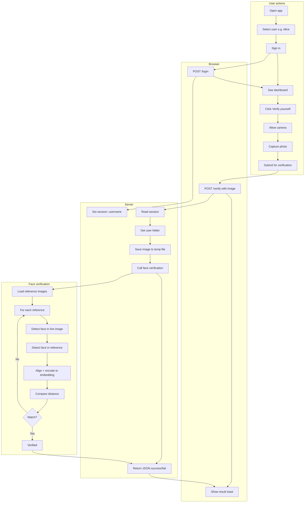
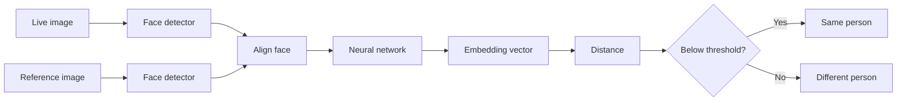
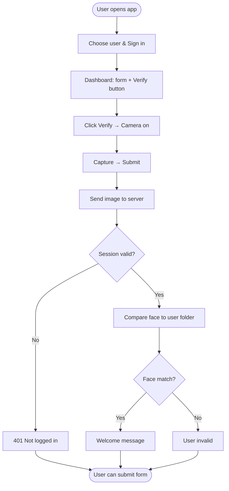
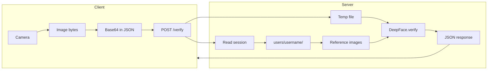

# Face Auth App — Flow Diagrams

Use these in presentations or paste the Mermaid code into [mermaid.live](https://mermaid.live) to export as PNG/SVG.

---

## 1. End-to-End Flow (Detailed)

---

## 2. Face Verification Pipeline (What happens inside “verify”)

---

## 3. Simplified One-Page Flow (For slides)

---

## 4. Data Flow (What data goes where)

---

## How to use

- **GitHub/GitLab:** These Mermaid blocks render automatically in `.md` files.
- **Export image:** Copy a code block → paste at [mermaid.live](https://mermaid.live) → export PNG/SVG.
- **Presentations:** Use the “Simplified one-page flow” for a single slide; use “End-to-End” for a detailed walkthrough.
